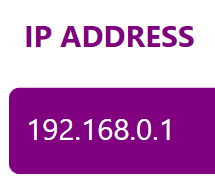

# SubnetCalculator  
SubnetCalculator is a program to plan and calculate the size of your network.  

## Installation

**You can get the latest version by clicking [here](https://github.com/WilcoMatthijssen/SubnetCalculator/blob/master/SubnetCalculator.exe).**

Works on Windows 10. Other programs could work but I havent tested those.

*This program is unsigned which means Windows will complain that this program could be unsafe. Reason for it not being published properly is that I didn't want to spend money on completing the signing process.*
  

## How to use
For the subnetcalculator to work it needs 2 things: an **IP address** and a **prefix**.  
The IP

The IP address are 4 numbers between 0 and 255 and separated by dots. It can by set by typing it in the left part of the top purple box.  

The prefix is a number between 8 and 30 and can be set by typing it in the prefix textbox (the area after the / in the top purple box) or the slider below that.  

When thats done it automaticly calculates all the things seen below.

- Network ID  
Network ID is the portion of an IP address that identifies the TCP/IP network on which a host resides.  

- Broadcast ID  
Broadcast address is the last address in the network, and it is used for addressing all the nodes in the network at the same time.  

- First IP & Last IP  
First and last usable IP in network.  

- Subnet mask & Wildcard mask  
Bits specifying what is used for the network/subnet and what isnt.  

- Hosts  
Amount of useable hosts with this network.  

## Future developments
If there is demand and or I have motivation to work on this project these are the things I'd like to work on.

- [ ] Add support for IPv6
- [ ] Make the program signed
- [ ] Separate string to int conversion from the subnetcalculator class
- [ ] Remove or make the use of the slider clearer.

